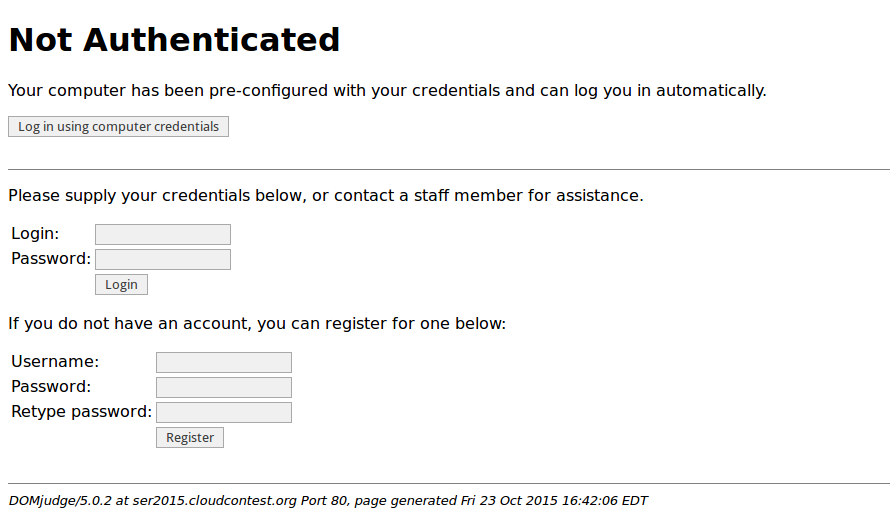

For the Southeast Regional Programming competition we use DOMjudge with
PHP_SESSION based authentication. Our contest is multi site over the internet,
and there are no known ip ranges or anything we could use other than regular logins.
Problem is we can't give out the credentials to the teams since they'd then have
an easier time sharing accounts.

In the past this has meant we needed volunteers to go around to the team computers
and manually log each team in at the beginning of the practice round, and again
after the computers have been cleaned at the beginning of the real contest. This
is just annoying, and can take a fair amount of time I'd rather spend fixing other
issues.

This year I finally came up with a solution. Each workstation runs a local squid
proxy, which combined with squidguard is what I use to restrict access to the
contestants on the internet.

Since all the team traffic passes through our local proxy, we can use it to inject
the team's credentials without them ever having access to them. Then I just have
to set up each computer once, and squid will take care of actually logging them
in.

The way I did this is by having squid watch for a certain pattern of url(DOMjudge
pages that require login), and adding a few headers to the request with the team
login name and password. So every time the team goes to a login page, DOMjudge
will see these headers and be able to act on them to log the team in.

The relevant part of my squid.conf looks like this:
```
acl autologin url_regex ^http://the.domjudge.server/team/
acl autologin url_regex ^http://the.domjudge.server/public/login.php$
include /etc/squid3/autologin.conf
```
And `/etc/squid3/autologin.conf`
```
request_header_add X-DOMjudge-Autologin true autologin
request_header_add X-DOMjudge-Login "domjudge_teamname" autologin
request_header_add X-DOMjudge-Pass "base64-encoded-password" autologin
```

What this does is set up an acl(named `autologin`) to match pages where the login
information might be needed, and then to add those 3 headers on any page that
matches. The permissions on the `/etc/squid3/autologin.conf` file are 640 so that
the team isn't able to just go in and read them.

Then I had to make a few changes on the DOMjudge side to check for credentials
in the headers instead of the `$_POST['user']` and `$_POST['pass']` variables.
See the short patch at the bottom of this post.

From the team perspective, they click on login, see this page below, then just
have to click on the "Log in using computer credentials" and they're done.
[](images/autologin-page.png)


Patch based off the DOMjudge 5.0 branch.
```diff
---
 lib/www/auth.php | 21 +++++++++++++++++++--
 1 file changed, 19 insertions(+), 2 deletions(-)

diff --git a/lib/www/auth.php b/lib/www/auth.php
index 5e72263..5acfcb6 100644
--- a/lib/www/auth.php
+++ b/lib/www/auth.php
@@ -153,6 +153,17 @@ function show_loginpage()
 Please supply your credentials below, or contact a staff member for assistance.
 </p>

+<?php
+if (isset($_SERVER['HTTP_X_DOMJUDGE_AUTOLOGIN']) && $_SERVER['HTTP_X_DOMJUDGE_AUTOLOGIN']=='true'){ ?>
+<p>You can log in using credentials that have been configured by your administrator.</p>
+<form action="<?php echo $_SERVER['PHP_SELF']; ?>" method="post">
+<input type="hidden" name="cmd" value="login" />
+<input type="hidden" name="autologin" value="true">
+<input type="submit" value="Log in using computer credentials">
+</form>
+<?php } // endif X_DOMJUDGE_AUTOLOGIN ?>
+
+
 <form action="<?php echo $_SERVER['PHP_SELF'] ?>" method="post">
 <input type="hidden" name="cmd" value="login" />
 <table>
@@ -243,8 +254,14 @@ function do_login()
 	// some specializations are handled by if-statements.
 	case 'IPADDRESS':
 	case 'PHP_SESSIONS':
-		$user = trim($_POST['login']);
-		$pass = trim($_POST['passwd']);
+		// Check for autologin headers
+    if (isset($_POST['autologin']) && isset($_SERVER['HTTP_X_DOMJUDGE_AUTOLOGIN']) && $_SERVER['HTTP_X_DOMJUDGE_AUTOLOGIN'] == 'true') {
+      $user = trim($_SERVER['HTTP_X_DOMJUDGE_LOGIN']);
+      $pass = base64_decode(trim($_SERVER['HTTP_X_DOMJUDGE_PASS']));
+    } else {
+      $user = trim($_POST['login']);
+      $pass = trim($_POST['passwd']);
+    }

 		$title = 'Authenticate user';
 		$menu = false;
```
